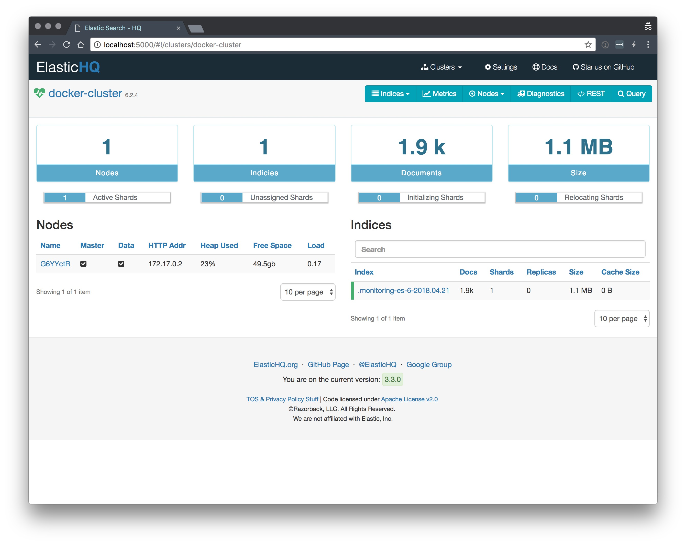

### ElasticHQ in a Docker 

[](https://travis-ci.org/pozgo/docker-elasticHQ)  
[](https://github.com/pozgo/docker-elasticHQ/issues)
[](https://github.com/pozgo/docker-elasticHQ)
[](https://github.com/pozgo/docker-elasticHQ)  
[](http://microbadger.com/images/pozgo/docker-elastichq) 
[](http://microbadger.com/images/polinux/elastichq)

[](https://hub.docker.com/r/polinux/elastichq/)

Felling like supporting me in my projects, please use donate button. Thank You!  
[](https://www.paypal.me/POzgo)

[Docker Image](https://registry.hub.docker.com/u/polinux/elasticHQ/) with [ElasticHQ](http://www.elastichq.org/). It's using tiny image provided by Alpine. It's over 100Mb smaller than official image.

ElasticHQ Management and Monitoring for Elasticsearch.

### Usage

```bash
docker run \
    -ti \
    --name elastichq \
    -p 5000:5000 \
    polinux/elastichq
```

### Access WebApp
Go to [http://localhost:5000](http://localhost:5000)

[](images/screen.jpg)

### Build

```bash
docker build -t polinux/elastichq .
```

Docker troubleshooting
======================

Use docker command to see if all required containers are up and running:

```bash
docker ps
```

Check logs of elastichq server container:

```bash
docker logs elastichq
```

Sometimes you might just want to review how things are deployed inside a running
 container, you can do this by executing a _bash shell_ through _docker's
 exec_ command:

```bash
docker exec -ti elastichq /bin/bash
```

History of an image and size of layers:

```bash
docker history --no-trunc=true polinux/elastichq | tr -s ' ' | tail -n+2 | awk -F " ago " '{print $2}'
```

## Author

Przemyslaw Ozgo